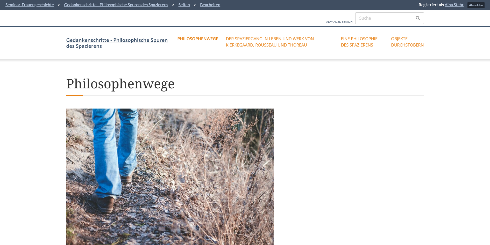
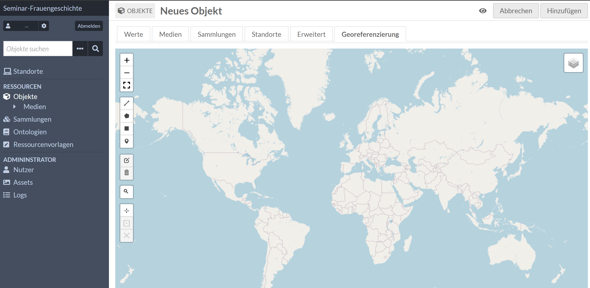

<!--

author: Aina-Jula Stehr
email: stu223341@mail.uni-kiel.de
version: 0.1
language: de
narrator: Deutsch Female

-->

# Omeka-S Workflow

## Was ist Omeka-S?

Omeka-S ist eine webbasierte Open-Source-Software, die speziell für die Erstellung und Verwaltung digitaler Sammlungen und Ausstellungen entwickelt wurde. Im Gegensatz zu traditionellen Content-Management-Systemen (CMS) wie WordPress liegt der Schwerpunkt von Omeka S auf der Verwaltung von Metadaten und der Präsentation wissenschaftlicher, kultureller oder historischer Inhalte.

Mit Omeka S können Sie...

- digitale Archive erstellen, indem Sie Inhalte wie Bilder, Texte, Videos und Dokumente in Sammlungen organisieren und zugänglich machen,
- semantische Verknüpfungen herstellen (Objekte können miteinander und mit externen Datenquellen verknüpft werden), 
- (mehrere) Webseiten innerhalb einer Installation gestalten (und diese, wenn gewünscht, miteinander verknüpfen),
- individuelle Metadaten-Schemata nutzen.

Um einen ersten Eindruck zu erhalten, können Sie sich [hier](https://omeka.org/s/showcase/) einige Anwendungsbeispiele ansehen. :-)

In diesem kurzen Workshop lernen Sie, wie Sie mit Omeka S eigene Webseiten erstellen können – von der grundlegenden Einrichtung von Sammlungen bis hin zur Gestaltung interaktiver Ausstellungen. 

## Grundfunktionen kennenlernen

  Melden Sie sich zunächst [hier](hier Hosting-Link) mit Ihrer stu-Mailadresse und dem Ihnen zugesendeten Passwort an. So gelangen Sie auf die über die CAU gehostete Omeka-S Plattform für unser Seminar.

### Nutzer*innen-Einstellungen

 
Unter *Nutzer* sehen Sie alle Mitglieder mit Ihren jeweiligen Rollen. Sie haben hier die Möglichkeit, Ihre eignen Nutzer*innen-Informationen und -Einstellungen zu bearbeiten und sich ein etwas handlicheres Passwort zu erstellen. ;-)

### Standorte

In Omeka-S werden die erstellten Websites - eventuell etwas irritierenderweise - als *Standorte* bezeichnet. Unter dieser Registerkarte werden Ihnen alle im Rahmen des Projektes bereits erstellten Websites angezeigt, zu denen Sie sich direkt weiterleiten lassen können. Steht Ihnen für eine Website die Rolle als Bearbeiter*in zur Verfügung, wird Ihnen dies durch ein Stift-Symbol angezeigt - durch Anklicken, gelangen Sie in den Workdesk für die jeweilige Website. 

Doch bevor wir uns den Funktionen der Website-Gestaltung zuwenden, erhalten Sie zunächst einen Überblick über die sogennten Ressourcen. **Alles**, was Sie an Items in Ihre Website einbauen wollen, wird unter diesem Bereich in sogenannten *Sammlungen* organisiert. 

>Damit Sie sich selbst aktiv mit Omeka-S vertraut machen und parallel selbst Ihre eigene Test-Website erstellen können, finden Sie in den folgenden Abschnitten kleine Arbeitsaufforderungen in Kästchen, wie diesem hier. Falls Fragen aufkommen, scheuen Sie sich bitte nicht, diese auf GitHub im Repository zu diesem Workshop zu stellen! Hier können wir uns alle untereinander unterstützen und die ein oder andere Frage, wird sicher auch uns herausfordern und Neues lernen lassen. ;-)

>Falls Sie lieber an einer bereits erstellten Ausstellung mitarbeiten wollen, sind Sie herzlich eingeladen die einzelnen Schritte dieses Workshops durch Mitarbeit an dem [folgenden Projekt](https://projekt03.omeka-s.ub.uni-kiel.de/admin/site/s/gedankenschritte-philosophische-spuren-des-spazierens) auszuprobieren. Alle Inhalte können frei verändert werden!

### Ressourcen

#### Objekte

 
Einzelne digitale oder physische Objekte, die Metadaten, Dateien (z. B. Bilder, Audio, Textdokumente) und Beschreibungen enthalten.
Sammlungen (Item Sets): Gruppierungen von Objekten, die thematisch, zeitlich oder anderweitig zusammengehören.

>Fügen Sie zunächst 3 neue Objekte (möglichst unterschiedlicher Art) hinzu:

Gehen Sie hierzu im Dashboard auf *Objekte* und klicken Sie auf *Neues Objekt hinzufügen*.
Jedes Objekt kann mit mehreren Dateien verbunden werden, wobei diese sowohl aus lokalen Speicherorten, als auch aus externen Quellen (z. B. URLs) importiert werden können. Laden Sie Medien (Bilder, Audio, Video oder PDF-Dateien) hoch, die mit dem Objekt verknüpft werden sollen.

 

 

Es ist wichtig, korrekte und möglichst detaillierte Metadaten für jedes Objekt anzugeben! (Omeka S verwendet standardmäßig Dublin Core, unterstützt aber auch andere kontrollierte Vokabulare.)
Geben Sie aussagekräftige Titel, Beschreibungen und Schlagwörter ein, um Objekte auffindbar zu machen. 

Angaben, die auf jeden Fall gemacht werden sollten, sind:
- Klasse
- Titel 
- Quelle
- Urheber*in
- Indentifikator  
- Nutzungsrechte (welche Lizenz?)

 

Möglich ist hier auch die Option einer Georeferenzierung. Auf Ihrer Website erscheint in diesem Fall eine Map, auf der Ihr Objekt verortet ist.

#### Sammlungen

Sammlungen können nun dazu genutzt werden, Objekte nach Themen, Projekten oder Kategorien zu strukturieren.

> In einem nächsten Schritt erstellen Sie eine Sammlung, der Sie Ihre Objekte hinzufügen.

Gehen Sie zu hierfür zu *Sammlungen* und klicken Sie auf *Neue Sammlung erstellen*.
Geben Sie einen Titel und optionale Beschreibungen ein. Sie können die bereitgestellte Ressourcenvorlage nutzen und eine passende Klasse auswählen. Durch die Zuweisung einer Klasse beschreiben Sie, welche Art von Objekten in der Sammlung enthalten sind, was unter anderem später die Suchfunktion erleichtert: 

 

 

Sammlungen können unter dem Tab *erweiterte Suche* nach Metadaten gefiltert werden, um spezifische Inhalte hervorzuheben. Die Klasse kann hier zusätzlicher Filter verwendet werden.

Zurück im *Objekt*-Bereich, können Sie nun Ihre Objekte der neu erstellten Sammlung zuweisen.

Die Anordnung der Objekte in Sammlungen ist flexibel und kann je nach Projektanforderung angepasst werden.

Ein kleiner Hinweis für künftige Projekte: Ein Objekt kann theoretisch auch mehreren Sammlungen gleichzeitig zugeordnet werden.

#### Objekte verknüpfen

In Omeka S lassen sich Objekte miteinander verknüpfen, um einen Kontext herzustellen.

>Verknüpfen Sie nun zwei Ihrer Objekte miteinander. (z. B. ein Foto mit der Biografie des Fotografen)
> Öffnen Sie hierzu eines der beiden Objekte (z. B. das Foto) im Bearbeitungsmodus.
>Fügen Sie eine neue Eigenschaft hinzu, die die Beziehung beschreibt (z. B. „Erstellt von“, dc:creator).
>Anstatt einen einfachen Text einzugeben, wählen Sie die Option, um eine Ressourcenreferenz zu verknüpfen: Wählen Sie das Objekt (z. B. die Biografie des Fotografen) aus der Liste der vorhandenen Ressourcen aus.

Nicht das Speichern der Änderungen vergessen! :-) 

Ihre beiden Objekte sind jetzt miteinander verknüpft - auf der öffentlichen Seite wird nun z. B. bei Ansicht des Fotos ein Link oder Hinweis auf die Biografie angezeigt und umgekehrt. Überprüfen Sie dies gerne selbst!

#### Ressourcenvorlagen

 

Eine Ressourcenvorlage wirkt wie ein Metadatenformular, das spezifisch auf die Anforderungen eines Projekts oder einer Sammlung zugeschnitten ist.

Ressourcenvorlagen legen fest:

- Welche Eigenschaften (Properties) für eine Ressource relevant sind (z. B. dc:title, dc:creator),
- Reihenfolge und Gruppierung der Eigenschaften
- Voreinstellungen und Einschränkungen für bestimmte Eigenschaften:
    - Standardwerte
    - Eingabebegrenzungen (z. B. erlaubte Datentypen).
    - Pflichtfelder

## Step by step: Eine eigene Website gestalten

### Website erstellen

> 1. Klicken Sie unter *Standort* auf *Neuen Standort hinzufügen*.
> 2. Geben Sie einen Titel und eine Beschreibung für die Website ein.
> 3. Legen Sie die URL der Website fest (z. B. https://ihrewebsite.de/thema). Sie können diesen Schritt auch überspringen, dann wird automatisch eine URL erstellt, die sie anschließend noch verändern können.
> 4. Entscheiden Sie durch einen Klick auf das *Augen-Symbol* oben rechts, ob die Website öffentlich oder privat sein soll.
> 5. Fügen Sie optional eine Kurzbeschreibung hinzu.
> 5. Speichern Sie die Website.

 

### Seitenlayout gestalten 

> Navigieren Sie zum Tab *Designvorlage* in dem Bearbeitungsmenü Ihrer Website.
> Wählen Sie das gewünschte Theme und passen Sie die Farben, Schriftarten und Layouts an, falls das Theme dies erlaubt.

Standardthemes wie Default oder Center Row sind in Omeka S bereits integriert.
[Hier](...) finden Sie alle offiziellen Omeka S Themes.

  

 

Und hier noch der [Link zu einer Anleitung zur Erstellung eigener Themes](https://omeka.org/s/docs/developer/themes/), um das Design Ihrer Website anzupassen - für die ganz motivierten ;-)

### Seitenstruktur erstellen

> 1. Öffnen Sie den Bearbeitungsmodus für die Website, die Sie gerade erstellt haben und navigieren Sie zum Tab *Seiten*.
> 2. Klicken Sie hier auf *Neue Seite hinzufügen*, um eine neue Seite zu erstellen, und geben Sie einen passenden Titel ein. (z. B. "Willkommen", „Über uns“, „Sammlung“).
> Erstellen Sie auch eine Unterseite via ... (z. B. „Sammlungen“ als Hauptseite mit Unterseiten wie „Fotografien“ und „Dokumente“).

Hinweis: Die Seitenhierarchie lässt sich unter *Navigation* via drag and drop variieren. Das Navigationsmenü erscheint auf Ihrer Website und erleichtert den Nutzer:innen die Navigation.

 

### Blöcke verwenden

Ihre einzelnen Seiten gestalten Sie mithilfe von sogenannten *Blöcken* - Bausteine, die jeweils auf bestimmte Inhalte oder Layouts ausgerichtet sind.

>Verwenden Sie den Seiteneditor, um einer Ihrer Seiten nun mindestens 3 verschiedene Blöcke hinzuzufügen.

 Hier ist eine Übersicht der wichtigsten Blöcke:

Kernblöcke (Standardmäßig verfügbar):
-----------

**Medien**

Zeigt hochgeladene Dateien wie Bilder, PDFs oder Videos direkt auf der Seite an.
Ideal, um visuelle Medien oder zusätzliche Dokumente zu präsentieren.

!Hinweis!: Sie können diejenigen Items einbinden, die Sie zuvor unter dem Tab *Ressourcen* im Bearbeitungsmenü Ihrer Website Ihrem *Item Pool* hinzugefügt haben. Achten Sie darauf, dass die Dateiformate korrekt eingebunden sind.

**Vorschau durchsuchen**

Zeigt eine Vorschau von Items oder Sammlungen in einem wählbaren Layout. 
Perfekt, um Teilaspekte Ihrer Inhalte auf der Startseite oder in Übersichten anzuzeigen.

**HTML-Block**

Ermöglicht das Hinzufügen von benutzerdefiniertem Text und HTML-Code.

**Item mit Metadaten**

Zeigt ein einzelnes Item mit zugehörigen Metadaten wie Titel, Autor oder Datum an.

**Zeilenumbruch**

Fügt zur Verbesserung der Lesbarkeit einen visuellen Abstand zwischen den Blöcken hinzu.

**Liste von Seiten**

Generiert automatisch eine Liste aller Seiten auf Ihrer Website. Dies kann für Navigationszwecke hilfreich sein oder als Inhaltsverzeichnis dienen.

**Liste von Websites**

Zeigt eine Übersicht über andere Omeka S-Websites an. (Hilfreich bei der Verwaltung von Multi-Site-Projekten)

**Medien einbetten**

Ermöglicht die Einbettung externer Medien, z. B. YouTube-Videos oder Audiodateien.
Hinweis: Stellen Sie sicher, dass die Plattform die URL unterstützt.

**oEmbed**

Integriert Inhalte von anderen Plattformen. 
Hinweis: Es werden nur oEmbed-kompatible URLs unterstützt.

**Seitendatum/-zeit**

Zeigt adaptiv das Erstellungs- oder Änderungsdatum der Seite an.

**Seitentitel**

Hebt für eine klare Struktur und Orientierung den Titel der Seite hervor.

**Inhaltsverzeichnis**

Erstellt eine navigierbare Liste von Abschnitten und Unterabschnitten auf der Seite.

 

Zusätzliche Blöcke (über Module oder Erweiterungen):
--------------

**Item-Karussell**

Zeigt zur attraktiven Präsentation mehrerer Ressourcen Items in einem rotierenden Karussell (interkative Gallerie)

**Geografische Karten (Mapping)**

Sind für Ihr Projekt räumliche Bezüge von Bedeutung, können Sie hiermit Orte auf Karten anzeigen, basierend auf geografischen Metadaten.

**Datenvisualisierung**

Erstellt Diagramme oder Grafiken zur Darstellung statistischer Daten.

**Accordion-Gruppe**

Erstellt "zusammenklappbare" Abschnitte.

**Bild-Banner**

Fügt einen großen visuellen Bannerbereich hinzu. (für einprägsame Kopfzeilen oder thematische Abschnitte)

 
**Hinweis**: Die Blöcke können in flexiblen Layouts (z. B. Spalten, Raster) kombiniert werden. Zudem unterstützen viele Blöcke benutzerdefinierte Stile (CSS) und Hintergrundbilder.

### Kollaboratives Arbeiten: Collecting

Die Collecting-Funktion in Omeka S ermöglicht es Administratoren, Nutzer-generierte Inhalte zu sammeln, indem sie benutzerdefinierte Formulare erstellen und diese auf der Website einbinden. Dies ist besonders nützlich für kollaborative Projekte, bei denen andere Projektteilnehmer*innen Informationen, Dateien oder persönliche Geschichten zu einer Sammlung beitragen sollen.

> Probieren Sie gerne [hier](https://projekt03.omeka-s.ub.uni-kiel.de/s/gedankenschritte-philosophische-spuren-des-spazierens/page/philosophenwege) die Collecting-Funktion aus, indem Sie Text oder Dateien einreichen. :-)

> Erstellen Sie eine Collecting-Form für Ihre Website:
 1. Stellen Sie zunächst unter dem Menüpunkt *Module* sicher, dass das Collecting-Modul installiert und aktiviert ist
 2. Navigieren Sie in dem Bearbeitungsmenü Ihrer Website zu *Collecting* und klicken Sie auf *Add new form*.
 3. Geben Sie einen Titel und eine Beschreibung ein und wählen Sie aus, in welcher Sammlung die Einsendungen gespeichert werden sollen.
 4. Fügen Sie unter *add prompt* benutzerdefinierte Felder mit jeweiligen Prompts hinzu, um die gewünschten Eingaben von Nutzer:innen zu strukturieren. Wählen Sie zwischen verschiedenen Feldtypen wie:
    Textfeld (für kurze Texteingaben)
    Textbereich (für längere Antworten)
    Auswahlfeld (Dropdown oder Radio-Buttons)
    Datei-Upload (für Bilder, Dokumente etc.).
    Felder können auf Wunsch als „Pflichtfelder“ markiert werden.
 5. Am Ende das *Sichern* nicht vergessen, um das Formular zu erstellen.
 6. Über den Block "Collecting" können Sie nun Ihr Collecting-Formular in eine beliebige Seite Ihrer Website einbinden
 7. Eingereichte Inhalte verwalten: Die Einsendungen werden automatisch der zugeordneten Sammlung hinzugefügt. Im Admin-Dashboard können Sie unter *Items* die eingereichten Inhalte einsehen, prüfen und bearbeiten.

 

Hier ein Beispiel:

### Erweiterungen und Funktionen hinzufügen

Falls Sie Plugins oder Module installiert haben, können Sie nach Konfiguration zusätzliche Funktionen einbinden.

Zum Beispiel...

- Suchfunktion: Integrieren Sie ein Suchfeld, um Ressourcen auffindbar zu machen.

- Geografische Karten: Verwenden Sie Module wie „Geolocation“, um Items auf einer Karte anzuzeigen.

- Zeitachsen: Zeigen Sie historische Ereignisse oder Entwicklungen interaktiv mit dem Modul „Timeline“ an.

Hier sind ein paar hilfreiche Links für Module und Erweiterungen:
--------

- Omeka S Module auf der offiziellen Seite
https://omeka.org/s/modules/

- Omeka S Modules auf GitHub
https://github.com/search?q=omeka+s+modules&type=repositories

- Page Blocks Modul (Seiteneditor-Erweiterung)
Dies ist ein Modul für zusätzliche Seitengestaltungselemente wie Akkordeons oder Spaltenlayouts.
https://omeka.org/s/modules/PageBlocks/

### Veröffentlichung

 

> 1. Klicken Sie auf *Vorschau*, um Ihre Website zu überprüfen.
> 2. Stellen Sie sicher, dass alle Seiten, Links und Inhalte wie gewünscht funktionieren.
> 3. Website online stellen: Wechseln Sie im Admin-Dashboard zum Tab Einstellungen der Website. Aktivieren Sie die Option *Öffentlich zugänglich machen*.

## Hilfreiche Links

Offizielle Dokumentation und Tutorials:

- Tutorial auf dem YouTube-Kanal der UTAS Library
https://youtu.be/Y41VRHM9n1k?feature=shared

- Offizielle Omeka S-Dokumentation (Umfassende Anleitungen für Installation, Konfiguration, Module und Themes)
https://omeka.org/s/docs/user-manual/

- Omeka S-Forum (Tauschen Sie sich mit der Community aus, stellen Sie Fragen oder finden Sie Lösungen für häufige Probleme)
https://forum.omeka.org/

- Omeka S GitHub Repository (Zugriff auf den Quellcode und die neuesten Updates für Omeka S und seine Module)
https://github.com/omeka/omeka-s
